# Atelier

<p align="center">
  <a href="docs/media/atelier.mp4">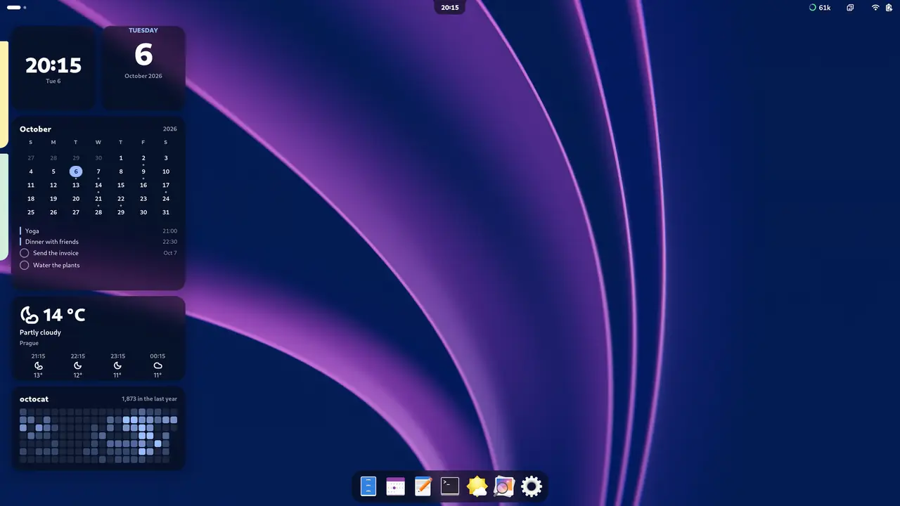</a>
  <br>
  <a href="docs/media/atelier.mp4"><b>▶ Watch the 21-second tour</b></a> (with sound): profiles, the island, notes that
  drip out of it, widgets
</p>

A GNOME Shell 48 extension that styles the whole desktop as one piece.
**Profiles** keep a look – wallpaper, light/dark style, accent, GTK and shell
theme, icons, cursor, font, palette and the widgets – and one key switches
between them. A **palette taken from the wallpaper** colors Atelier and, if you
want, GTK apps and GNOME Terminal. In the middle of the top bar, an **island**
takes the place of GNOME's clock: it grows into a glance, the notifications and
the control centre, and new notes drip out of it. On the desktop there are
**widgets** on glass, **notes** pinned to the edge of the screen and a
**dock**. It started as *BG Changer*.

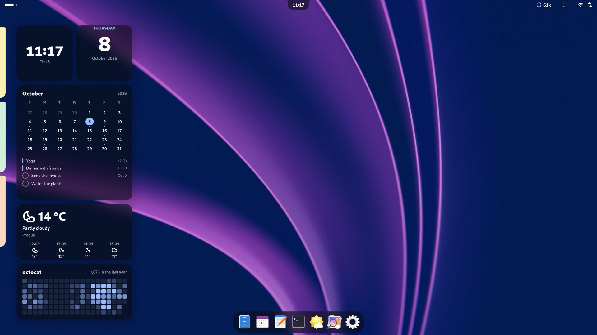

## Profiles

- **Switcher**: press <kbd>Super</kbd>+<kbd>W</kbd> (or click the button in the
  top bar). The island grows into it (without the island, a dark panel drops
  from the top of the screen), with two tabs:
  - *Profiles* – pick one with the arrow keys, scrolling or the mouse and press
    <kbd>Enter</kbd>: the island says its name, the new wallpaper is revealed
    by a growing circle under the widgets, then the themes and colors switch.
  - *Wallpapers* – the pictures in `~/Pictures/Wallpapers` (or another folder).
    Picking one changes the wallpaper for now; no profile changes.

  <kbd>Tab</kbd> switches between the tabs.
- **Profiles stay as you saved them.** A wallpaper picked for a while, or
  anything changed in GNOME Settings, leaves them alone; switching to a
  profile brings its look back. The widgets are the exception: what you change
  on the desktop is kept in the profile in use.
- **A new profile**: pick the **+** card at the end of the Profiles tab. The
  island drips a sheet with what the desktop has now – the wallpaper, style,
  themes, palette and widgets – to name it and choose light or dark and the
  accent; *More in Settings…* opens the rest.
- **Settings** live in the preferences: open *Extension Manager* (or
  *Extensions*) and click the gear next to Atelier.

When Atelier starts for the first time it saves your current setup as a
profile called **Original**, so there is always a way back.

<table>
  <tr>
    <td width="50%">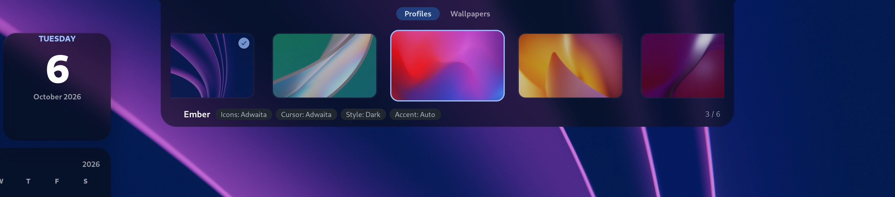</td>
    <td width="50%">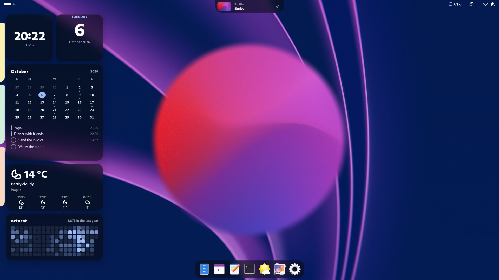</td>
  </tr>
  <tr>
    <td align="center"><sub>The switcher grows out of the island</sub></td>
    <td align="center"><sub>Enter: the next look comes in under the widgets</sub></td>
  </tr>
  <tr>
    <td width="50%">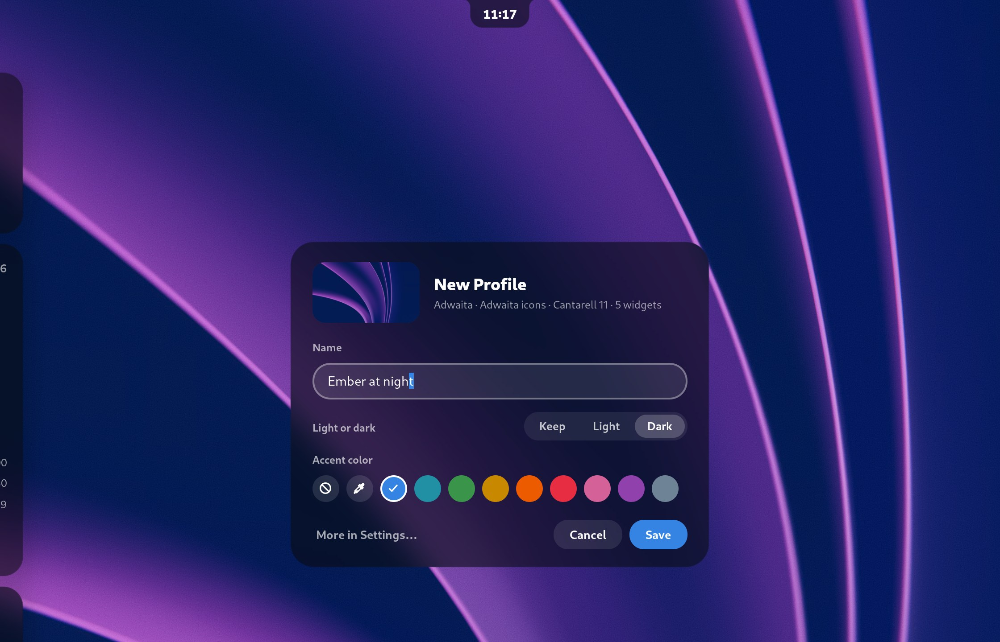</td>
    <td width="50%">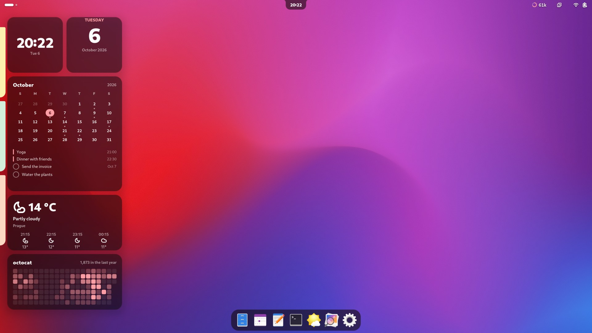</td>
  </tr>
  <tr>
    <td align="center"><sub>A new profile, on a sheet that drips from the island</sub></td>
    <td align="center"><sub>Another profile: the widgets and the glass take its colors</sub></td>
  </tr>
</table>

## The island

- **Island**: a black capsule (or glass) in place of GNOME's clock. It shows
  the time (and a microphone while an app records, a dot for unseen
  notifications, the Do Not Disturb icon). Rest the pointer on it for a
  glance – a big clock, this week, what's left of today's events and the
  weather, from GNOME's own calendar and weather. Clicking it opens the
  control centre. The glance's power button opens a power menu (Lock,
  Suspend, Log Out, Restart, Power Off); after a profile switch the island
  briefly shows its name.
- **Notifications** appear in the island instead of under the top bar. GNOME
  still decides what shows (Do Not Disturb, its per-app settings, the queue)
  and they stay in the notification list. Per app you choose the buttons:
  the app's own, none, or *Reply* and *Mute* (Reply opens the conversation;
  Mute keeps the app's banners away for an hour, 8 hours or until you unmute
  it in the settings). WhatsApp (as a Chrome app) starts with Reply and Mute,
  Claude with none.
- **Control centre**: click the island (or <kbd>Super</kbd>+<kbd>S</kbd>) for
  GNOME's quick settings in the island – sound, brightness, Wi‑Fi, Bluetooth,
  power mode, night light, dark style, keyboard light, airplane mode and the
  tiles of extensions such as Caffeine, with their menus. Further tabs hold
  GNOME's notification list with Do Not Disturb (<kbd>Super</kbd>+<kbd>V</kbd>),
  the calendar with the day's events, the notes, Claude Code's numbers and the
  icons extensions put into the top bar, as tiles that do what the icons did.
  GNOME's own menus don't open anymore; the status icons in the bar only show
  the state. Of glass, the open island is live: the windows under it show
  through, blurred.
- **Claude Code**: a ring in the bar shows how far the current 5-hour block
  is, with the tokens Claude wrote in it; resting the pointer on it (or the
  control centre's Claude tab) shows the block, today, the last seven days
  and the sessions running. Atelier reads only the token counts in Claude
  Code's local history (`~/.claude/projects`), in a background process, and
  keeps them in its cache; nothing is sent anywhere.

<table>
  <tr>
    <td width="50%">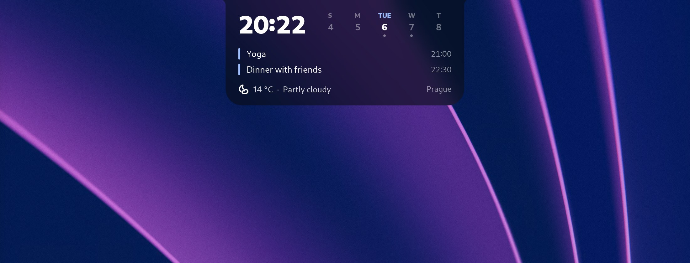</td>
    <td width="50%">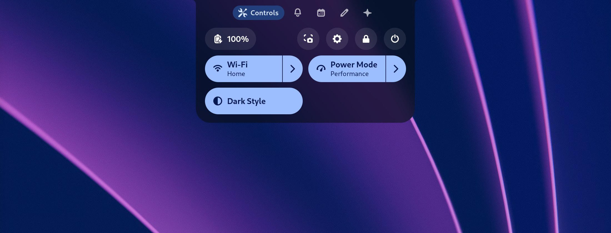</td>
  </tr>
  <tr>
    <td align="center"><sub>Resting on it: a glance</sub></td>
    <td align="center"><sub>A click: the control centre</sub></td>
  </tr>
  <tr>
    <td width="50%">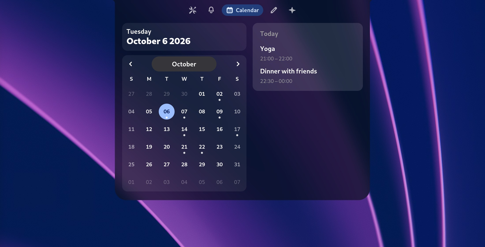</td>
    <td width="50%">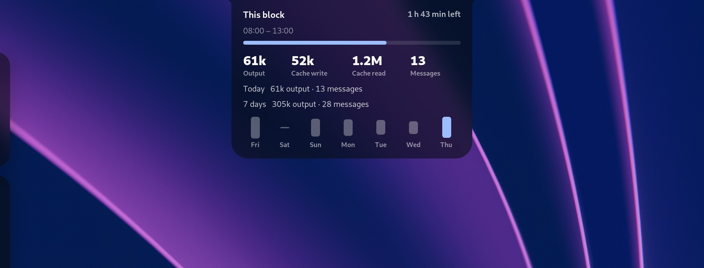</td>
  </tr>
  <tr>
    <td align="center"><sub>The calendar tab</sub></td>
    <td align="center"><sub>Claude Code's numbers, from the ring in the bar</sub></td>
  </tr>
  <tr>
    <td colspan="2">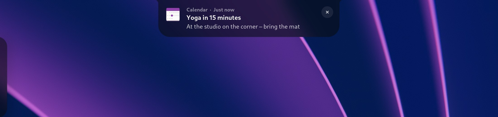</td>
  </tr>
  <tr>
    <td colspan="2" align="center"><sub>Notifications come in the island</sub></td>
  </tr>
</table>

## Top bar

*Grouped* (the workspaces, the island and the status icons together in the
middle), *Spread* (the workspaces at the left edge, the status icons at the
right one), *One island* (all of it in one island) or *GNOME*'s bar. The sides
sit on the wallpaper or in capsules like the island; the island floats below
the top edge or hangs from it as a *notch*, and it is black or **glass** –
Atelier's own blur of the wallpaper, tinted with the palette. *Only the
essentials* keeps a grouped bar or one island to the workspaces, the time and
the battery. On a monitor with a full screen window none of it shows. (If
Blur my Shell blurs the bar, turn that off.)

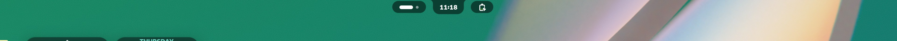

## On the desktop

- **Widgets** lie on the wallpaper, under the windows: a clock, the date, the
  month with today's events and your Google Tasks (from GNOME Online
  Accounts), the weather, anyone's GitHub contributions (from GitHub's public
  page, no account needed), Claude Code's block, a photo, and how many Slack
  messages came since you last looked at Slack and who wrote them (counted
  from its notifications; what they say is never shown or kept) – as
  *Modern* cards, on glass, or on *Analogue* paper. Right-click the desktop
  and choose *Edit Widgets*: drag one and a shadow on the grid shows where it
  lands;
  stretch one by its corner and it snaps to the nearest of its sizes (a click
  on the corner gives the next one); the gallery at the bottom adds more.
  Switching workspaces, they slide along with the wallpaper.
- **Notes**: square papers in seven colors with a title, text and checkboxes
  (a line starting with `- [ ]`: <kbd>Enter</kbd> on one starts the next line
  with one too, *Checkbox* puts one on every line selected), pinned to the
  left (or right) edge of the main monitor – a strip of each peeks out, all
  of it under the pointer, with a button in its corner that puts it into the
  archive. A new note (*New Note* in the desktop's menu, or the control
  centre's Notes tab) drips from the island onto a sheet to write on (its
  title first, <kbd>Tab</kbd> on to its text), and so does a note you click;
  <kbd>Ctrl</kbd>+<kbd>Enter</kbd> saves it – a new
  one runs off to its edge in a drop, and its paper spreads out of the edge
  there. *Remind
  me* on the sheet gives a note a reminder – a day and a time, shown on its
  paper – and at that time a notification comes, with *Open* and *In 10 min*
  (one due while the computer was off or locked comes as soon as it is back).
  The Notes tab has them all, and an archive. They are the same whatever the
  profile.
- **Dock**: the pinned apps and those with windows on the workspace, at the
  bottom of the screen; it moves out of the way of windows, and the bottom
  edge brings it back. Dynamic Music Pill sits at its end. It stays off while
  Dash to Dock is enabled.

<table>
  <tr>
    <td width="50%">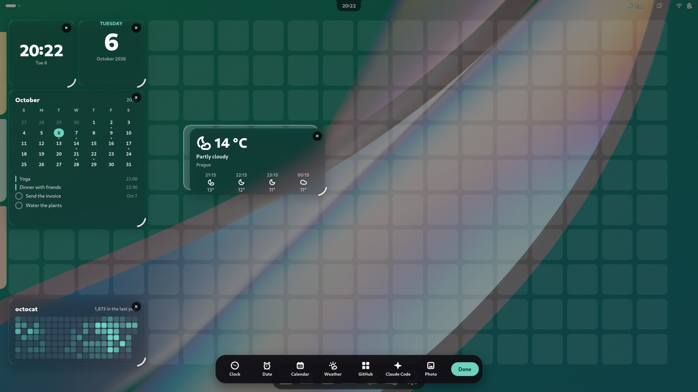</td>
    <td width="50%">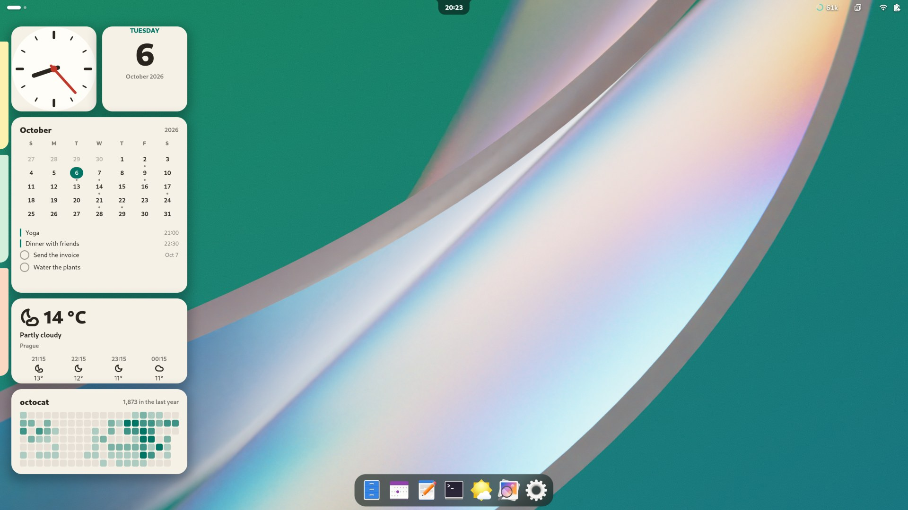</td>
  </tr>
  <tr>
    <td align="center"><sub>Edit Widgets: drag, stretch, snap</sub></td>
    <td align="center"><sub>Analogue: paper and a clock face</sub></td>
  </tr>
  <tr>
    <td width="50%">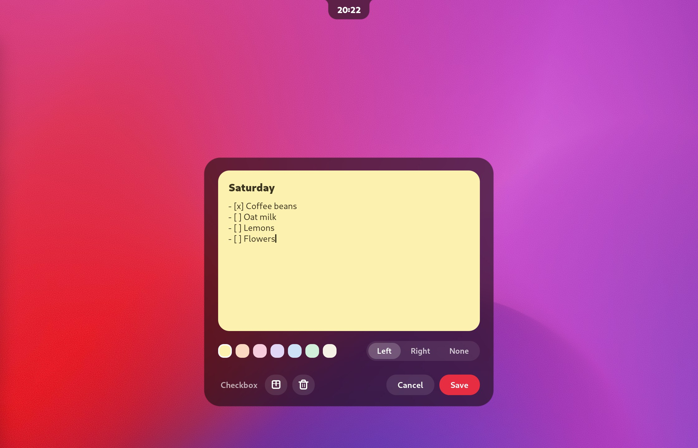</td>
    <td width="50%">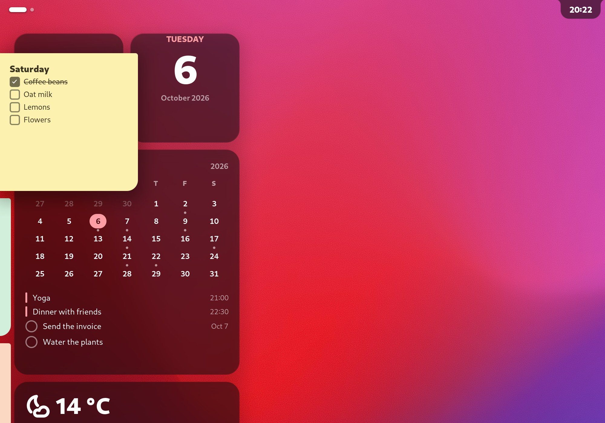</td>
  </tr>
  <tr>
    <td align="center"><sub>A note, written on a sheet from the island</sub></td>
    <td align="center"><sub>Pinned to the edge</sub></td>
  </tr>
  <tr>
    <td width="50%">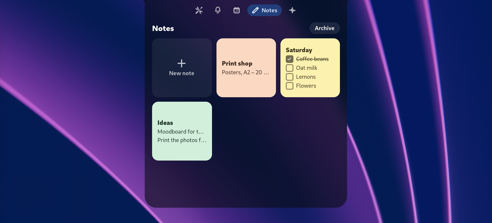</td>
    <td width="50%">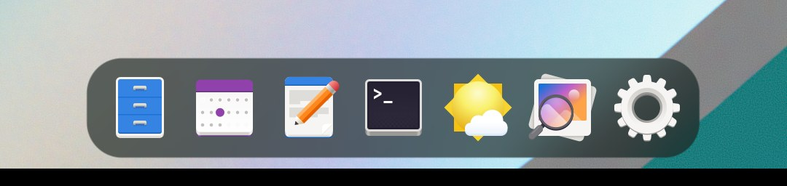</td>
  </tr>
  <tr>
    <td align="center"><sub>All of them in the Notes tab</sub></td>
    <td align="center"><sub>The dock</sub></td>
  </tr>
</table>

## Palette

The palette comes from the wallpaper: its colors are grouped into a few
swatches, the most fitting one becomes the source, and a full set of colors
for dark and light is built from it (Settings → Appearance). You can pick
another swatch or one of nine fixed palettes instead, and choose how colorful
it is (vibrant, muted, monochrome). The "Auto" accent of a profile uses it.

Optional, in Settings → Appearance:

- **Color GTK apps** – Atelier writes `~/.config/gtk-4.0/gtk.css` and
  `~/.config/gtk-3.0/gtk.css`: libadwaita apps take the palette's accent and a
  hint of its color, in both light and dark. Open apps need a restart. Atelier
  never overwrites a `gtk.css` it didn't write.
- **Color GNOME Terminal** – a terminal profile "Atelier" (a copy of your
  default profile with the palette's colors) becomes the default; switching
  the option off brings your profile back.

## Settings

<table>
  <tr>
    <td width="33%">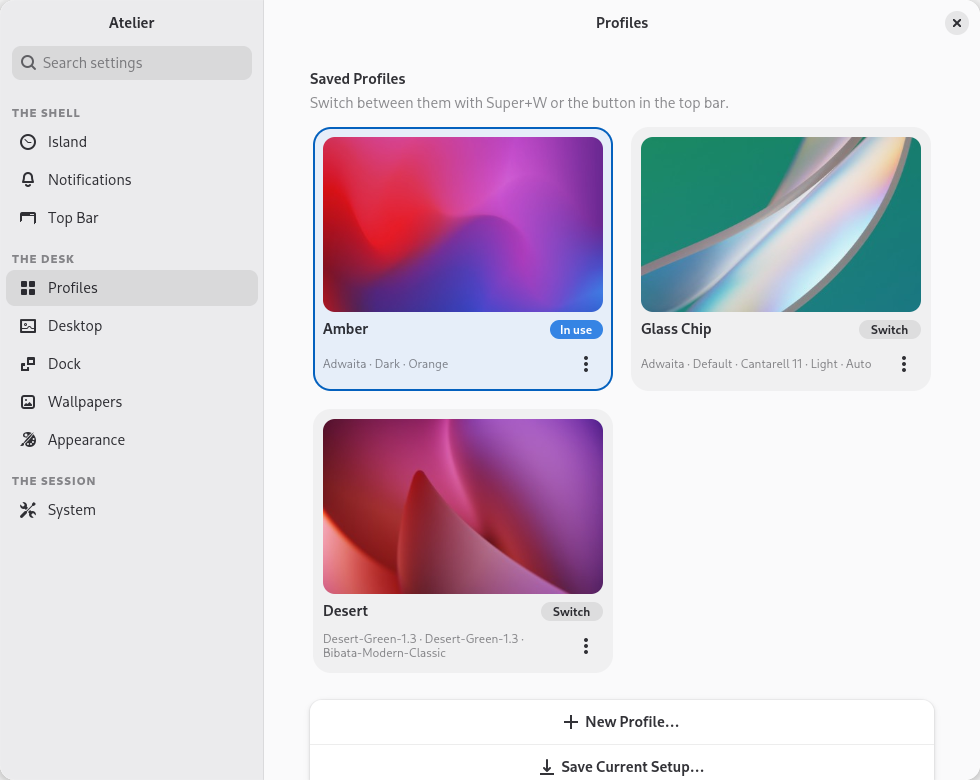</td>
    <td width="33%">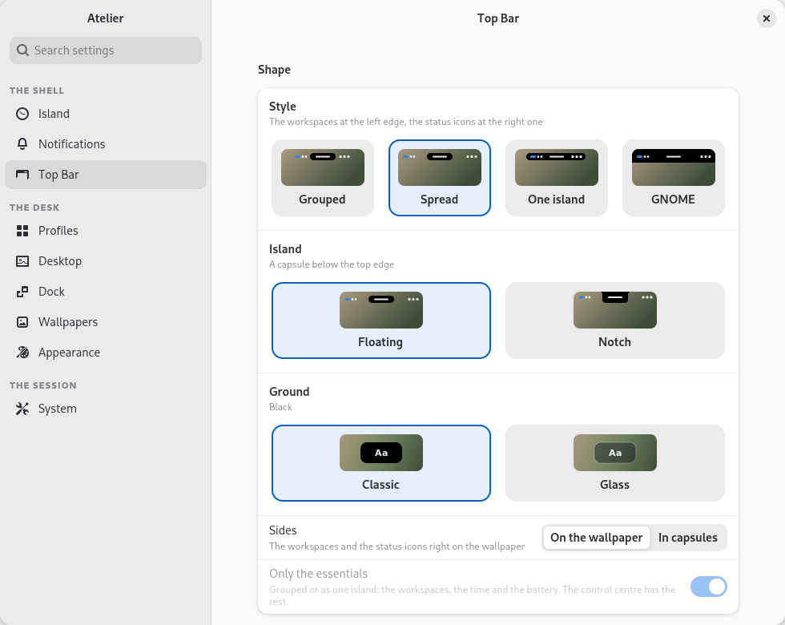</td>
    <td width="33%">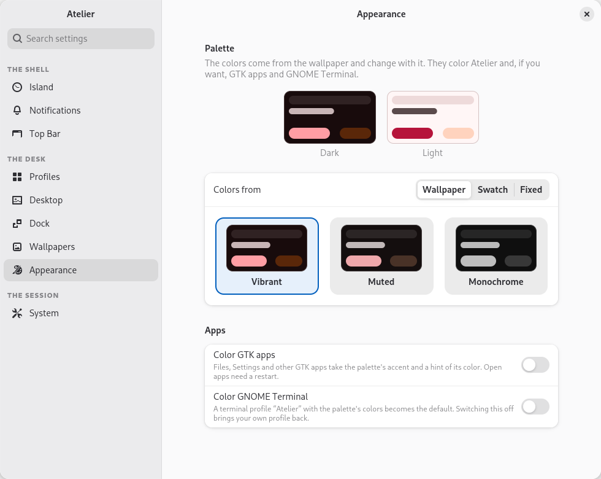</td>
  </tr>
</table>

## Install

```sh
make install          # symlinks this folder into ~/.local/share/gnome-shell/extensions/atelier@local
```

On Wayland GNOME Shell only notices new extensions after you log out and back
in. Then enable it:

```sh
gnome-extensions enable atelier@local
```

Shell themes are applied through the **User Themes** extension, which has to
be enabled as well.

### Coming from BG Changer

Atelier takes over BG Changer's data the first time it starts: looks become
profiles, the shortcuts and transition settings carry over, and the wallpaper
copies move to `~/.local/share/atelier`. Disable BG Changer and remove its link
before logging in with Atelier:

```sh
gnome-extensions disable bg-changer@local
rm ~/.local/share/gnome-shell/extensions/bg-changer@local
```

## Themes: why they used to break the desktop

- **Shell themes are tied to the GNOME version.** A theme made for GNOME 42 or
  older doesn't know the quick settings menu, the new notifications and other
  parts of GNOME 48, so the shell ends up half styled and partly broken.
  Atelier flags such themes (Settings → System → Theme Check, and in the
  profile editor). Use themes that list GNOME 47/48 support.
- **Most GNOME apps ignore GTK themes.** Apps built with libadwaita (Files,
  Settings, Text Editor, …) don't read the `gtk-theme` setting at all; only
  GTK 3 apps do. A theme can still restyle them if it ships a `gtk-4.0`
  folder: turn on *Also theme GTK 4 / libadwaita apps* in a profile and
  Atelier imports that stylesheet into `~/.config/gtk-4.0/gtk.css`, following
  the light/dark style.
- **Archives in `~/.themes`** (e.g. `Theme.tar.xz`) make the User Themes
  settings fail to list themes. Extract them and remove the archive.
- If something goes wrong anyway: Settings → System → **Reset Appearance to
  GNOME Defaults**, or switch to the *Original* profile.

## Where things are stored

| What | Where |
| --- | --- |
| Profiles and settings | GSettings `org.gnome.shell.extensions.atelier` |
| Copies of the wallpapers | `~/.local/share/atelier/wallpapers/` |
| Notes | `~/.local/share/atelier/notes.json` |
| Thumbnails, smaller copies of the photo widget's pictures, generated shell styles | `~/.cache/atelier/` |
| GTK styles (optional) | `~/.config/gtk-4.0/gtk.css`, `~/.config/gtk-3.0/gtk.css` |
| Terminal colors (optional) | GNOME Terminal profile "Atelier" |

Wallpapers are copied when a profile keeps them, because the original file may
be moved or overwritten (the wallpaper portal always writes to
`~/.config/background`). Deleting a profile deletes its copies, unless the
desktop is still showing them.

## Development

| Command | What it does |
| --- | --- |
| `make check` | Validates the schemas and the syntax of every module |
| `make test` | Unit tests for the shared modules (`tests/`) |
| `make shell-test` | Runs the extension in a throwaway headless GNOME Shell (with BG Changer data to take over) and checks the island, notifications, the control centre, the bar, widgets, notes, the dock, switching, the transition, the palette, GTK styles, terminal colors, saving profiles and the Wallpapers tab; then, on two monitors (the second one to the right of the main one, then to its left), that the notes stay on the main one; screenshots land in `tests/output/shell` and `tests/output/shell-two-monitors` |
| `make prefs` | Opens the preferences without the Extensions app (settings in memory) |
| `make prefs-screenshots` | Renders every settings section headlessly and drives the main flows |
| `make showcase` | Takes the pictures in `docs/screenshots` in a headless GNOME Shell on a 4K monitor at scale 2, with a few profiles of GNOME's own wallpapers (the settings pictures come from `make prefs-screenshots`); `ATELIER_SHOWCASE_FRAMES=<folder> tools/showcase.sh` also records a few moments in slow motion, frame by frame, for a video |
| `make pack` | Builds `dist/atelier@local.shell-extension.zip` |

The test sessions use their own settings, data, cache and runtime
directories under `tests/output`, so they never touch the running desktop.

Layout:

- `extension.js` – takes over BG Changer's data and starts the modules
- `shell/` – runs inside GNOME Shell: `core/` (module manager, generated
  styles, glass, GTK and terminal colors), the profiles module (switcher,
  transition, applying and saving profiles), the palette module,
  `island/` (the island, its pages and the sheet that drips from it),
  `notifications/` (banners in the island), `controlCentre/` (quick settings
  and extension icons in the island), `bar/` (the top bar's look),
  `claude/` (Claude Code's numbers), `desktop/` (the widgets), `notes/` and
  `dock/`
- `prefs.js`, `prefs/` – the settings app (GTK 4 / libadwaita)
- `lib/` – shared by both: profiles, palette, migration, theme discovery,
  thumbnails, GTK stylesheets, terminal profile, widgets' layout, notes
- `tools/` – development harnesses
- `docs/` – the pictures and the video in this README

## Uninstall

```sh
gnome-extensions disable atelier@local
make uninstall
```

Switch off *Color GTK apps* and *Color GNOME Terminal* first (or use Reset
Appearance) to remove Atelier's GTK styles and terminal profile. The copied
wallpapers and the notes stay in `~/.local/share/atelier` until you delete
that folder.
